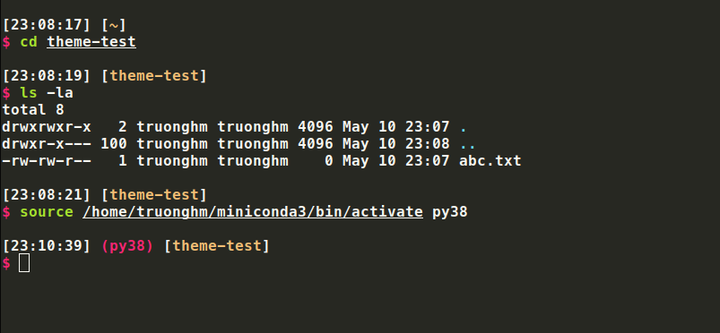

# Python-compatible themes for zsh

This repository contains themes ported from the default and several other popular Zsh themes to be compatible with Python, mainly to be able to display information about the current Python virtual environment.


## Installation

### **zsh** — the Z shell

#### If you're using Oh My Zsh

1. Download theme: \
   `git clone --quiet https://github.com/truonghm/zsh-python-themes ~/.oh-my-zsh/custom/themes/python-themes`
2. Select theme using `omz`: \
   `omz theme set python-themes/<theme_name>`
3. Reload current zsh session: `omz reload`

#### Without Oh My Zsh

1. Download theme to the themes directory, for example, `~/.zsh/themes`: \
   `git clone --quiet https://github.com/win0err/aphrodite-terminal-theme ~/.zsh/themes/python-themes`
2. Select theme by sourcing it in `.zshrc`: \
   `echo 'source ~/.zsh/themes/python-themes/<theme_name>.zsh-theme' >> ~/.zshrc`
3. Load theme immediately in current session: \
   `source ~/.zsh/themes/python-themes/<theme_name>.zsh-theme`
#### Avoid disabling env twice

For conda, run:

```bash
conda config --set changeps1 False
```

For venv, put this line into your `~/.zshrc`:

```bash
export VIRTUAL_ENV_DISABLE_PROMPT=1
```

## Screenshots

### Ys Python



<!-- ### **fish** — the friendly interactive shell

1. Backup existing `fish_prompt.fish` file: \
   `cp ~/.config/fish/functions/fish_prompt.fish{,.bak}`
2. Download prompt:
   ```sh
   wget https://raw.githubusercontent.com/win0err/aphrodite-terminal-theme/master/fish_prompt.fish \
	    -O ~/.config/fish/functions/fish_prompt.fish
   ```

> **Author's note:** It looks even cooler when: \
> a) theme is set to `None`: `fish_config theme save None`, \
> b) autosuggestions are disabled: `echo 'set -g fish_autosuggestion_enabled 0' >> ~/.config/fish/config.fish`.

### bash — GNU Bourne-Again SHell

1. Download theme to the themes directory, for example, `~/.bash/themes`: \
   `git clone --quiet https://github.com/win0err/aphrodite-terminal-theme ~/.bash/themes/aphrodite`
2. Select theme by sourcing it in `.bashrc`: \
   `echo 'source ~/.bash/themes/aphrodite/aphrodite.theme.sh' >> ~/.bashrc`
3. Load theme immediately in current session: \
   `source ~/.bash/themes/aphrodite/aphrodite.theme.sh` -->


---
_Developed by [Truong Hoang](https://github.com/truonghm)_
